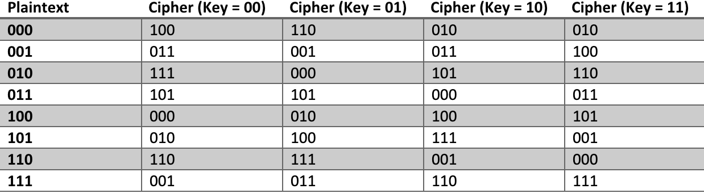

# Block Cipher

Block Cipher is another symmetric encryption algorithm, it works by take a block of the plaintext and then using a key to pick a permutation of the possible outputs.  

# Block Cipher Example 
 For example, for a 3-bits block and 2-bits key 
 

Suppose our key = 01, message = 101, then the ciphertext = 100. 

Note: not all possible permutations are used here. 

For a block that has N-bit inputs there are 2^N! possible permutations and for a key that has k-bits there are 2^k possible keys. Each key will map to a unique permutation. It is very likely that not every permutation will be used. 

One of the nice things about Block Cipher is that it is extremely hard to break that is it is very expensive to try since there is no known efficient algorithm that can break Block Cipher without having to brute-force it. 

In real life where key size is as long as 256 bits, there will not be a key-plaintext-ciphertext table. Instead, an interesting pseudo-random permutation algorithm will be used to make the encryption algorithm efficient. 

