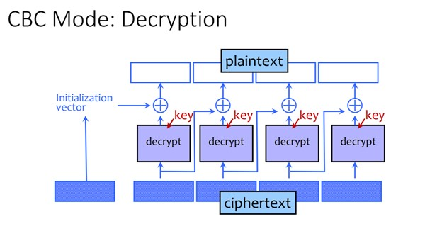

# Cipher Block Chaining
## To Encrypt:

Reference:
    [Link to the picture](https://courses.cs.washington.edu/courses/cse484/21sp/slides/cse484-lecture10-sp21.pdf)
-	A random IV which has the same length as a block will be generated
-	Save the IV as C[0] (first block of the ciphertext)
-	Let SK = IV, for i = 0, i < number of blocks, i++:
    - Xor SK with the Plaintext[i] to get Temp
    - Pass Temp through a block cipher with the key K to get C[i + 1]
    - Let SK = C[i + 1]

## To Decrypt:

Reference:
    [Link to the picture](https://courses.cs.washington.edu/courses/cse484/21sp/slides/cse484-lecture10-sp21.pdf)

To Decrypt:
-	For i = number of blocks - 1, i >= 1, i--:
	- Decrypt C[i] using the decryption algorithm of the block cipher with the key K to get Temp
    - Xor Temp with C[i – 1] to get Plaintext[i – 1]

