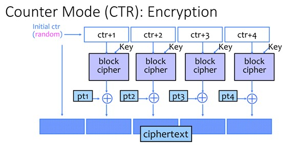

# Counter Mode Encryption

Unlike ECB, counter mode adds in randomness to each ciphertext block.

# Encryption Algorithm
### Given key K and message M,
1. Like ECB, counter mode will first divide a long plaintext into multiple 	N-bits long blocks. 
    - `M → M[0],M[1],…,M[n]`

2. Randomly generate a N-bits Initialization Vector (IV). Save it as `C[0]`, i.e. the first block of the ciphertext.

3. For the i-th plaintext block:
    - Encrypt `IV + (i + 1)` using block cipher with key K.
        - treat IV as an integer, then add `i + 1` to it. If the result overflows, disregard the most significant bit
    - Xor the encrypted `IV + (i + 1)` with the `i-th` plaintext block.
    - Save the result as C[i + 1] or `(i + 1)th` block of the ciphertext.

    Visually:
    

    Reference:
    [Link to the picture](https://courses.cs.washington.edu/courses/cse484/21sp/slides/cse484-lecture10-sp21.pdf)

# Decryption Algorithm

### Given key K and ciphertext C,
1. Divide the long ciphertext into multiple N-bits long blocks.

2. Take `C[0]` out and treat it as the IV

3. To get the `i-th` plaintext block:
    - Encrpyt `IV + (i + 1)` using the same block cipher with key K
    - Using the result, xor with the ciphertext block `C[i + 1]` to get the plaintext block `M[i]`

# Advantages:
1. We do not need to run the block cipher's decryption algorithm

2. It does not need padding if the message length is not a mulitple of N. (Recall N is the block size)

