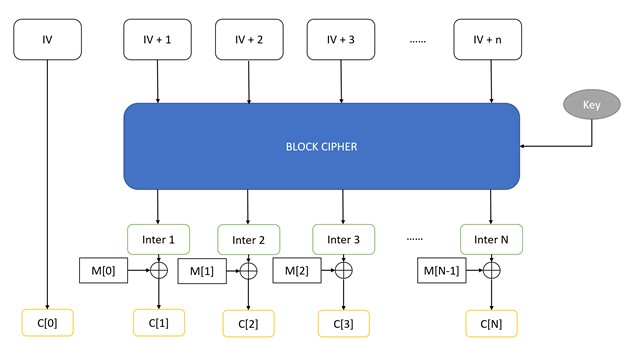

# Reusing the IV

There are a few things that we need to know before talking about reusing IV:
1. Block Cipher is deterministic. i.e. On a given key and message, a block cipher will always output the same ciphertext.
    - If `Key = k and Message = M`,
    - `Block Cipher(k,M) = Cipher text = Block Cipher(k,M)` 
    - No matter when these operations are done.
	
2. If messages are not the same, outputs will be random. i.e., you cannot predict the ciphertext of M, given the ciphertext of M’.
	
3. In counter mode, inputs to the block cipher are always different. Based on point 2, we could say the outputs of the block cipher are random. Since we are xoring each message block with a randomly generated bit-string, we are just applying OTP on each block.

### Assuming we do not change the key

## What would happen if we reused an IV?

1.	IV used to encrypt 2 messages will be the same.
2.	IV + 1, IV + 2, …, IV + n used in these 2 encryptions will be the same.
3.	Outputs of the block cipher, (inter 1, inter 2, …, inter N) will be the same since block cipher is deterministic given fixed message and key.
4.	If inter 1, inter 2, …, inter N are the same in these 2 encryptions, we are essentially applying OTP using a used key which is problematic.
